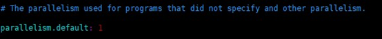

# 尚硅谷Java_Flink知识笔记(入门)

> 该笔记为观看B站视频所做Flink笔记，作为基础入门学习。
>
> apache Flink官方网址：https://flink.apache.org/
> 
> B站视频链接：https://www.bilibili.com/video/BV1qy4y1q728?p=7
>
> 学习完成后，会将源码上传到github 
>
> 语言设置的是js，仅因为是会带有代码高亮，写的还是java 

# 1. Flink的特点

* 事件驱动（Event-driven）

* 基于流处理

  一切皆由流组成，离线数据是有界的流；实时数据是一个没有界限的流。（有界流、无界流）

* 分层API

  + 越顶层越抽象，表达含义越简明，使用越方便
  + 越底层越具体，表达能力越丰富，使用越灵活

# 2. 快速开始

## 2.0 修改pom依赖

> 使用的版本信息：Java(JDK1.8)、Maven(3.8.4)、Flink(1.14.2)

```xml
<?xml version="1.0" encoding="UTF-8"?>
<project xmlns="http://maven.apache.org/POM/4.0.0"
         xmlns:xsi="http://www.w3.org/2001/XMLSchema-instance"
         xsi:schemaLocation="http://maven.apache.org/POM/4.0.0 http://maven.apache.org/xsd/maven-4.0.0.xsd">
    <modelVersion>4.0.0</modelVersion>

    <groupId>org.example</groupId>
    <artifactId>flink_study</artifactId>
    <version>1.0-SNAPSHOT</version>

    <properties>
        <maven.compiler.source>8</maven.compiler.source>
        <maven.compiler.target>8</maven.compiler.target>
        <flink.version>1.12.1</flink.version>
        <scala.binary.version>2.12</scala.binary.version>
    </properties>

    <dependencies>
        <dependency>
            <groupId>org.apache.flink</groupId>
            <artifactId>flink-java</artifactId>
            <version>${flink.version}</version>
        </dependency>
        <dependency>
            <groupId>org.apache.flink</groupId>
            <artifactId>flink-streaming-scala_${scala.binary.version}</artifactId>
            <version>${flink.version}</version>
        </dependency>
        <dependency>
            <groupId>org.apache.flink</groupId>
            <artifactId>flink-clients_${scala.binary.version}</artifactId>
            <version>${flink.version}</version>
        </dependency>
    </dependencies>

</project>
```

## 2.1 批处理实现WordCount

> 支持相对路径，数据源可直接添加到resources下
> 
> 以下示例使用的数据源test.txt的内容如下:
> 
> hello abcd
> 
> hello world
> 
> yeye begin
> 
> end begin

```js
package org.example.WordCount;

import org.apache.flink.api.common.functions.FlatMapFunction;
import org.apache.flink.api.java.DataSet;
import org.apache.flink.api.java.ExecutionEnvironment;
import org.apache.flink.api.java.tuple.Tuple2;
import org.apache.flink.util.Collector;

/**
 * @Author: xubenqi
 * @date: 2022/2/18 2:12 AM
 */
public class WordCount_DataSet {

    public static void main(String[] args) throws Exception {

        // 创建执行环境
        ExecutionEnvironment env = ExecutionEnvironment.getExecutionEnvironment();
        // 从本地文件读取数据
        String inputpath = "src/main/resources/test.txt";  // 路径为相对路径 放在 resources下
        DataSet<String> InputDataSet = env.readTextFile(inputpath);
        // 对数据集进行处理
        DataSet<Tuple2<String, Integer>> resultSet = InputDataSet.flatMap(new MyflatMapper())
                .groupBy(0) // 按第一个字段的值分组
                .sum(1); // 按第二字段的值求和
        resultSet.print(); // 输出结果
    }
    // 自定义类，实现FlatMapFunction接口
    private static class MyflatMapper implements FlatMapFunction<String, Tuple2<String, Integer>> {
        @Override
        // collector 为收集器，收集处理后的结果
        public void flatMap(String s, Collector<Tuple2<String, Integer>> collector) throws Exception {
            String[] word = s.split(" ");// 按空格切词
            for (String it : word) { // 遍历字符数组
                collector.collect(new Tuple2<>(it, 1)); // 收集结果
            }
        }
    }
}
```

输出：

```shell
(abcd,1)
(yeye,1)
(begin,2)
(end,1)
(world,1)
(hello,2)

```

## 2.2 流处理实现WordCount

* **批处理与流处理的区别：**
    + 批处理=>几组或所有数据到达后才处理；流处理=>有数据来就直接处理，不等数据堆叠到一定数量级
    + 批处理有groupBy => 所有数据统一处理，而流处理用的是keyBy => 每一个数据都对key进行hash计算，进行类似分区的操作，来一个数据就处理一次，所有中间过程都有输出

```js
package org.example.WordCount;

import org.apache.flink.api.common.functions.FlatMapFunction;
import org.apache.flink.api.java.tuple.Tuple2;
import org.apache.flink.streaming.api.datastream.DataStream;
import org.apache.flink.streaming.api.environment.StreamExecutionEnvironment;
import org.apache.flink.util.Collector;

/**
 * @Author: xubenqi
 * @date: 2022/2/18 2:12 AM
 */
public class WordCount_DataStream {
    public static void main(String[] args) throws Exception {

        // 创建流处理执行环境
        StreamExecutionEnvironment env = StreamExecutionEnvironment.getExecutionEnvironment();
        // 从本地文件读取数据
        String InputPath = "src/main/resources/test.txt"; // 路径为相对路径 放在 resources下
        DataStream<Tuple2<String,Integer>> resultData = env.readTextFile(InputPath).
                flatMap(new WordCount_DataSet.MyflatMapper())
                // 直接使用批处理创建的方法
                .keyBy(item->item.f0) // keyBy(0) 已被弃用
                .sum(1);
        resultData.print(); //输出结果
        env.execute();//执行任务 按照流式的方式
    }
}
```

输出： 

* 由于是流处理，所以会打印出每一步的过程。

```shell
4> (hello,1)
7> (abcd,1)
6> (begin,1)
12> (yeye,1)
4> (hello,2)
7> (world,1)
6> (begin,2)
10> (end,1)
```


> **tips**
>
> 1. 这里`env.execute();`之前的代码，可以理解为是在定义任务，只有执行`env.execute()`后，Flink才把前面的代码片段当作一个任务整体（每个线程根据这个任务操作，并行处理流数据）。
>
> 2. 通过 `env.setMaxParallelism(32);` 设置并行度，默认值 = 当前计算机的CPU逻辑核数（设置成1即单线程处理）
>

## 2.3 流式数据源测试

> 简单的说就是从socket流中读取数据

* 通过`nc -lk <port>`打开一个socket服务，用于模拟实时的流数据
    + l => listen 监听
    + k => keep 保持链接 

```shell
nc -lk 7777
```

* 从socket文本流读取数据

```js
DataStream<String> inputDataStream = env.socketTextStream("localhost", 7777); // 替换上面的inputpath
```

> 执行程序后可以发现，对于相同的字符串，前面的进程编号也相同。
>
> 是因为key => hashcode,同一个key的hash值固定，分配给相对应的线程处理。


# 3. Flink部署(暂不学习)


## 3.1 Standalone模式

> Standalone模式主要是flink自己做一个资源调度，通常配合ZoomKeeper使用。


## 3.2 Yarn模式（常用）

## 3.3 Kubernetes部署

# 4. Flink运行时架构(暂不学习)


# 5. Flink流处理API

## 5.1 Environment(环境)

### 5.1.1 getExecutionEnvironment


创建一个执行环境，表示当前执行程序的上下文。如果程序是独立调用的，则此方法返回本地执行环境；
如果从命令行客户端调用程序以提交到集群，则此方法返回此集群的执行环境，也就是说，`getExecutionEnvironment`会根据查询运行的方式决定返回什么样的运行环境，是最常用的一种创建执行环境的方式。


`ExecutionEnvironment env = ExecutionEnvironment.getExecutionEnvironment();`

`StreamExecutionEnvironment env = StreamExecutionEnvironment.getExecutionEnvironment();`

如果没有设置并行度,会以flink-conf.yaml中的配置为准，默认是1。



### 5.1.2 createLocalEnvironment

返回本地执行环境，需要在调用时指定默认的并行度。

`LocalStreamEnvironment env = StreamExecutionEnvironment.createLocalEnvironment(1); `并行度为1

### 5.1.3 createRemoteEnvironment

返回集群执行环境，将Jar提交到远程服务器。需要在调用时指定JobManager的IP和端口号，并指定要在集群中运行的Jar包。

`StreamExecutionEnvironment env = StreamExecutionEnvironment.createLocalEnvironment(1);`

> 一般情况下，直接使用第一种方式创建执行环境即可，第二种用于本地环境测试，第三种用于创建远程环境。

## 5.2 Source(数据源)

> [Flink-Environment的三种方式和Source的四种读取方式](https://blog.csdn.net/qq_40180229/article/details/106335725)

### 5.2.1 Source - 从集合读取数据

> 使用`fromElements`和`fromCollection`都可以实现读取集合数据操作

```js
package org.example.API.Source;

import org.apache.flink.streaming.api.datastream.DataStream;
import org.apache.flink.streaming.api.scala.StreamExecutionEnvironment;
import org.example.API.beans.SensorReading;  // 自定义SensorReading类，包含id,timestamp,temperature;

import java.util.Arrays;

/**
 * @Author: xubenqi
 * @date: 2022/2/25 12:37 AM
 */
public class Source_from_List {

    public static void main(String[] args) throws Exception {
        //创建执行环境
        StreamExecutionEnvironment env = StreamExecutionEnvironment.getExecutionEnvironment();

        // 设置env并行度1，使得整个任务抢占同一个线程执行
        env.setParallelism(1);

        // 1.从collection中读取数据
        DataStream<SensorReading> dataStream = env.getJavaEnv().fromCollection(
                Arrays.asList(
                        new SensorReading("sensor_1", 1547718199L, 35.8),
                        new SensorReading("sensor_6", 1547718201L, 15.4),
                        new SensorReading("sensor_7", 1547718202L, 6.7),
                        new SensorReading("sensor_10", 1547718205L, 38.1)
            )
        );
        //打印输出
        dataStream.print("SensorReading Test");
        //执行任务
        env.execute("flink job");
    }
}
```

输出：

```shell
SensorReading Test> SensorReading{id='sensor_1', timestamp=1547718199, temperature=35.8}
SensorReading Test> SensorReading{id='sensor_6', timestamp=1547718201, temperature=15.4}
SensorReading Test> SensorReading{id='sensor_7', timestamp=1547718202, temperature=6.7}
SensorReading Test> SensorReading{id='sensor_10', timestamp=1547718205, temperature=38.1}
```

> 代码中`print`和`execute`后面的字符串的含义
>
> print: 表示当前输出流的名称 
>
> execute: 表示任务提交后的任务名称，用于区分任务

### 5.2.2 Source - 从文件读取数据

> 方式同2.1相同, 直接读取本地file, 不记录代码了

### 5.2.3 Source - 从Kafka消息队列读取数据

> 在做正常的数据流处理时，数据正常来说不会出现在集合或者文件中。
>
> 在实际的生产环境中，一般都会从kafka作为Source.

* 1. **引入kafka连接器的pom依赖**

写入pom.xml文件中，然后直接用maven更新依赖项即可

```xml
<!-- kafka -->
<dependency>
   <groupId>org.apache.flink</groupId>
   <artifactId>flink-connector-kafka_${scala.binary.version}</artifactId>
   <version>${flink.version}</version>
</dependency>
```

* 2. **启动zookeeper**

    > 安装教程：[docker安装zookeeper教程](http://bujidao.site/index.php/2021/09/13/docker%E5%AE%89%E8%A3%85zookeeper%E7%9A%84%E4%BD%BF%E7%94%A8%E8%AF%B4%E6%98%8E/)
    > 
    > 使用mac直接安装zookeeper: `brew install zookeeper`

    docker中启动zookeeper: 
    
    

* 3. **启动kafka服务**

    > 在docker中安装kafka: [docker安装kafka教程](https://juejin.cn/post/6960820341631352868)
    > 
    > 使用mac直接安装kafka: `brew install kafka`

    启动服务
    ```
    brew services start zookeeper
    brew services start kafka
    ```

* 4. **启动kafka生产者**

    > [启动kafka各种操作](https://blog.csdn.net/YAJUN0601/article/details/109454943)

    启动生产者:
    `kafka-topics --create localhost:2181 --replication-factor 1 --partitions 1 --topic test`

    topic名称为test


* 5. **编写java代码**

    > addSource方法是传参类型是SourceFunction,但是不需要自己去重写接口,可以使用FlinkkafkaConsumer

    


### 5.2.4 Source - 自定义Source

除了以上的source数据来源, 我们还可以自定义source。需要做的只是传入一个SourceFunction即可。


## 5.3 Sink(落库)


> Source表示数据源、Compute可表示为Flink计算过程、Sink表示数据输出


# 主要学习一下Window和CEP


